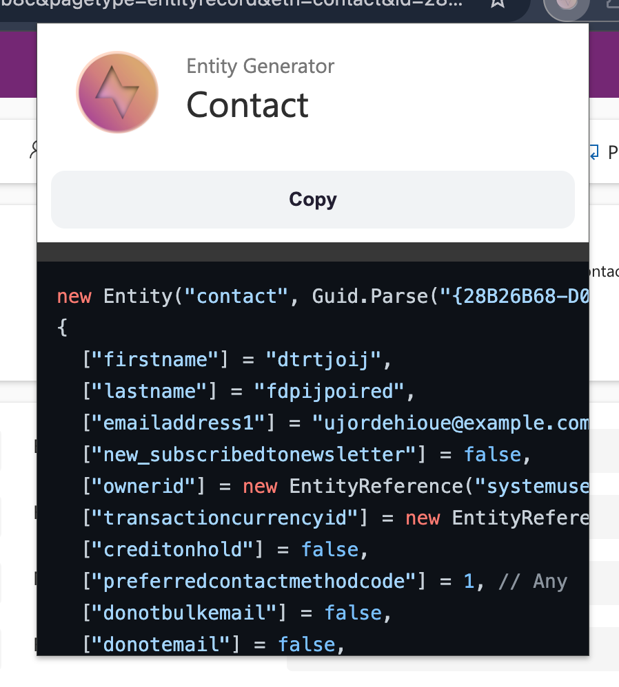

# Dynamics EntityGen

A simple Chrome/Edge plugin which allows you to easily generate Unit Test data.

## Installation

-   Clone repo locally
-   Go to `chrome://extensions`
-   Enable **Developer mode**
-   Click **Load Unpacked**
-   Find the cloned folder
-   Pin the extension to the toolbar

## Usage

When on Dynamics Form, click on the plugin icon. The generated C# code will show, allowing you to copy it with a click of a button.

## TODO

-   [ ] Test and fix Partylist type
-   [ ] Change format to JSON - so that it works with OData too.
-   [x] Test all field types - what fields are there? (TODO)
-   [x] Reliability - when opened on another site / not on form
-   [x] Reliability - when on form, but not connected to worker

## Planned actions

-   [x] Generate an entity when opened
    -   [x] All field types work - what fields are there? (TODO)
-   Change format to JSON - so that it works with OData too.
-   Add null fields if you want
-   Add all fields, not just the ones on the form
-   [x] Add only fields on the current form - that's by default
-   Intercept request and get the grid FetchXml
-   Enter custom FetchXml and have that converted into
-   Relationships data generator

### How it works: Generate a C# Entity

-   Worker Request: GetBasicAttributes
-   Worker returns all attributes
-   popup-entitygen creates the entity and adds it to the textarea on the popup
-   Has its own state - stores the attributes and exposes one method: render()
    -   entityname
    -   attributes
    -   nonNull - true/false
    -   haveAllAttributes - true/false - if all attributes have been fetched
-   User can click "Copy" button and that copies the script to the clipboard

-   This is also run on start

### How it works: Change format to JSON

-   Must have called "Generate a C# Entity" before so that the attributes exist.
-   Get the attributes from the popup
-   Generate the JSON from the attributes - basically just JSON.stringify with indent

### How it works: Only non-null

-   Must have called "Generate a C# Entity" before
-   sets the state, calls render() again

### How it works: Only form fields

-   This is a default

### How it works: All fields

-   If haveAllAttributes is already set, no action
-   Else, ask the worker to get all the fields, return them, rerender.

### How it works: Intercept request and get the grid FetchXml

-   Worker does this by default. Then it depends if
